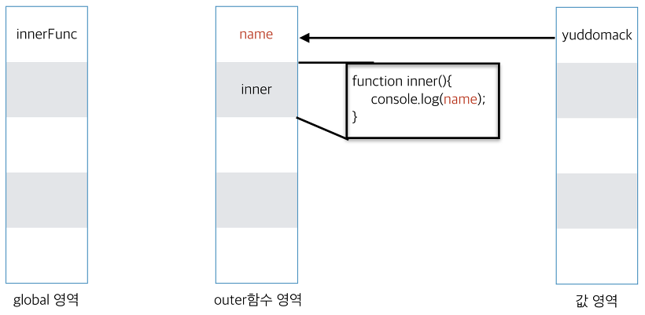
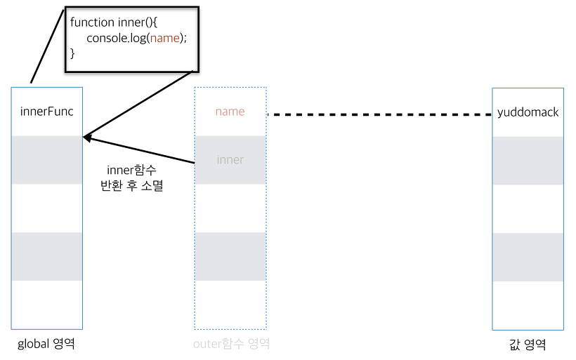
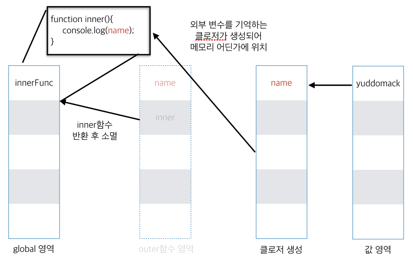
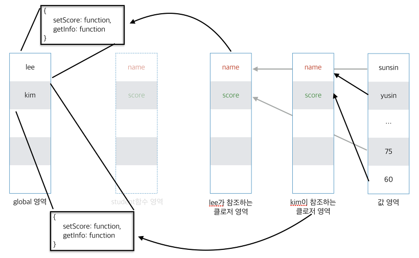
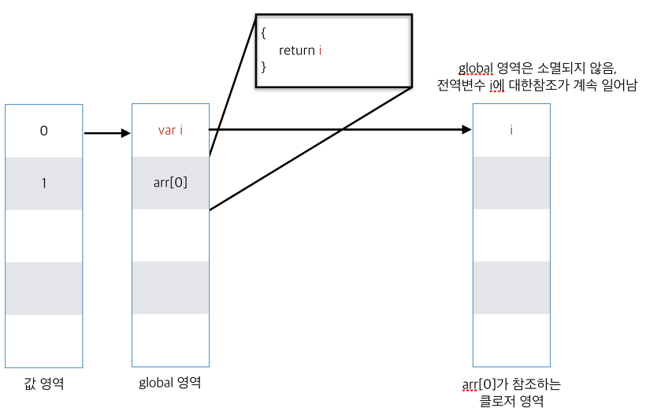
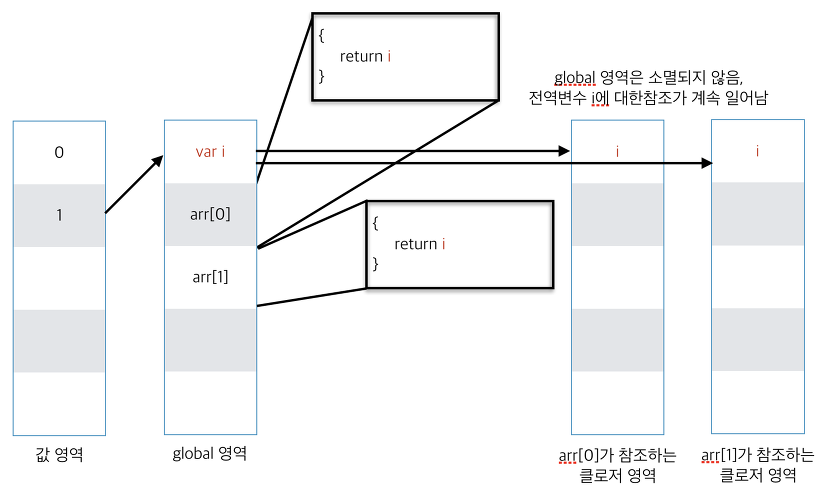
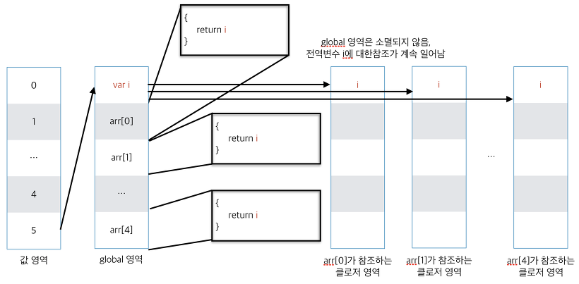
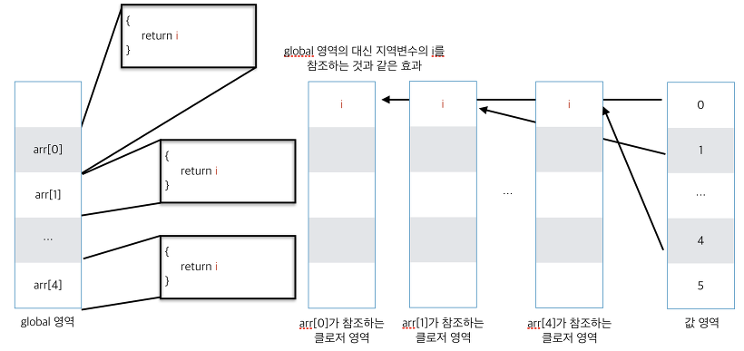

## 자바스크립트 클로저(Closure)

### 클로저

간단하게 정리하면 함수 밖에서 선언된 변수를 함수 내부에서 사용할 때 클로저가 생겨난다고 할 수 있습니다.

```javascript
// <외부 변수(name)를 함수 내부(inner)에서 사용>
function outer(){
  var name = 'yuddomack';
  function inner(){
    console.log(name);
  }
  return inner;
}

var innerFunc = outer();
innerFunc();
```

위 코드에서 outer함수는 메모리 상에 아래와 같은 모습을 하게됩니다. 



이제 var innerFunc = outer()를 통해서 inner 함수를 반환받게 되는데, **일반적으로 함수가 종료되면 메모리에서 소멸**하기 때문에 아래와 같은 모습을 하게됩니다.



때문에 일반적으로, innerFunc를 호출해도 name에 대한 참조는 메모리에서 소멸하여 호출이 불가하게 됩니다.
하지만 클로저는 이러한(외부 변수와 같은) 환경 자체를 통째로 기억하는 공간을 형성합니다.



이러한 이유로 innerFunc는 여전히 자신의 외부에서 생성된 name이라는 변수를 참조할 수 있게 됩니다.

### 캡슐화

클로저 영역이 별도로 생성되는 모습은 마치 객체를 생성한 모습과 유사합니다.

자바스크립트의 var는 전역적인 특성을 지니고 있지만 클로저의 특성을 이용하면 private 변수를 갖는 클래스 형태로 만들 수 있습니다.

```javascript
// <클로저의 특성을 이용한 private 접근> 
function student(name, score){
  // var name = name, score = score;
  return {
    setScore: function(_score){
      score = _score;
    },
    getInfo: function(){
      return { name:name, score:score };
    }
  }
}

var lee = student("sunsin", 80);
var kim = student("yusin", 75);

lee.setScore(60);

console.log(lee.getInfo()); // { name: 'sunsin', score: 60 }
console.log(kim.getInfo()); // { name: 'yusin', score: 75 }
```

student 함수의 반환값을 보면, 외부 변수(name, score 파라미터)가 함수의 내부(익명함수)에서 사용되는 모습을 보이기 때문에 클로저의 생성을 짐작할 수 있습니다.

이에 따른 모습을 도식화하면 아래와 같습니다.



프로토타입을 사용한 객체 생성도 가능하지만 이렇게 클로저를 이용하는 것으로도 클래스 객체의 모습을 흉내낼 수 있습니다.

그리고 new 함수()로 생성한 객체와 다르게 lee나 kim객체의 (외부)변수, 즉 파라미터인 name이나 score에는 lee.name 과 같은 방식으로 직접 접근할 수 없습니다.


### 싱글톤

클로저는 함수의 형태를 띄고있기 때문에 즉시실행함수의 모습으로 싱글톤 패턴을 따라할 수 있습니다.

```javascript
// <임의로 생성한 candle.js파일>
// candle.js
module.exports = (function(){
  var state = false;
  return {
    on: function(){
      state = true;
    },
    off: function(){
      state = false;
    },
    getState: function(){
      return state;
    }
  }
})();
```

```javascript
// <candle.js를 불러와서 사용하는 모습>
// index.js
var candle1 = require('./candle.js');
console.log(candle1.getState()); // false;
candle1.on();
console.log(candle1.getState()); // true;

var candle2 = require('./candle.js');
console.log(candle2.getState()); // true;
```

candle.js에서 클로저를 생성하는 함수를 모듈화 했습니다.


즉시 실행되었기 때문에 다른 파일에서 여러번 호출하더라도 하나의 클로저 영역을 공유 할 뿐, 각각의 클로저를 생성할 수 없습니다.

하나의 인스턴스만을 공유하는 싱글톤 패턴과 같은 특징을 갖게됩니다.

### 흔히 하는 실수

종종 클로저에 대해서 생각하지 못할때가 있습니다.

특히 dom에 콜백 이벤트를 작성할 때 종종 발생하곤 합니다.

```javascript
// <실수하기 쉬운 상황>
var usernames = ['kim', 'park', 'lee'];

function doSomething(index){
  // doSomething ...
  console.log(index);
}

for(var i=0; i<usernames.length; i++){
  document.getElementById(usernames[i]).onClick = function(){
    doSomething(i);
  }
}
```

위의 코드가 실행되고 kim, park, lee 엘리먼트를 클릭하면 공교롭게도 모두 3이 출력됩니다.

변수 i가 호이스팅으로 인해 전역변수화 되고, 이를 익명함수에서 참조하여 클로저가 생성되기 때문입니다.


좀 더 간략한 코드로 살펴보겠습니다.

```javascript
var arr = [];
for(var i=0;i<5;i++){
    arr[i] = function(){
        return i;
    }
}
for(var j=0;j<arr.length;j++) {
    console.log(arr[j]());
}
```

위 코드는 외부 변수 i를 사용하는 익명함수를 arr 배열에 담는 일을 하고 있습니다.

하지만 콘솔창에는 5가 다섯번 출력됩니다.


이는 클로저가 생성되지만 전역변수 i가 소멸되지 않아 참조가 공유되기 때문이고, for문에 따른 모습은 아래와 같습니다.







위 처럼 5개의 클로저 모두 같은 전역변수 i를 참조하는 형태가 됩니다.

한가지 유의할점은 for문을 통해 i가 5까지 증가한다는 점 입니다.


만약 내부 함수에서 array[i]와 같은 참조가 일어나면 예상하지 못한 결과가 나타날 것 입니다.


이를 방지하기위해 익명함수를 한번 더 덮어서 i에 대한 참조를 독립시켜주는 클로저를 생성하거나 let 문법을 사용할 수 있습니다.

```javascript
// <클로저를 중첩으로 사용하여 전역변수 i의 참조영역 독립>
var arr = [];
for(var i = 0; i < 5; i++){
    arr[i] = function(i){
      return function(){
          return i;
      }
    }(i);
}
for(var j=0;j<arr.length;j++) {
    console.log(arr[j]());
}
```


```javascript
// <let 변수를 사용하여 i의 참조영역 독립>
var arr = [];
for(let i=0;i<5;i++){
    arr[i] = function(){
        return i;
    }
}
for(var j=0;j<arr.length;j++) {
    console.log(arr[j]());
}
```

전역변수 i를 인자로 받는 즉시실행 함수에서 i는 익명함수의 파라미터로 동작하기 때문에 별도의 영역을 생성하며, 내부 함수는 이 별도의 영역의 i를 참조하기 때문에 지역변수를 사용한 것과 같은 효과를 냅니다.


let i for문 내 지역변수로 유효하기 때문에 사실상 각 i가 다른 변수처럼 취급됩니다.


위와 같은 방법으로 선언 시점의 환경을 독립시켜줄 수 있습니다.

이에 대한 참조 모습은 아래처럼 바뀌게 됩니다.



[참조](https://developer.mozilla.org/ko/docs/Web/JavaScript/Guide/Closures#%EB%A3%A8%ED%94%84%EC%97%90%EC%84%9C_%ED%81%B4%EB%A1%9C%EC%A0%80_%EC%83%9D%EC%84%B1%ED%95%98%EA%B8%B0_%EC%9D%BC%EB%B0%98%EC%A0%81%EC%9D%B8_%EC%8B%A4%EC%88%98#%ED%81%B4%EB%A1%9C%EC%A0%80)