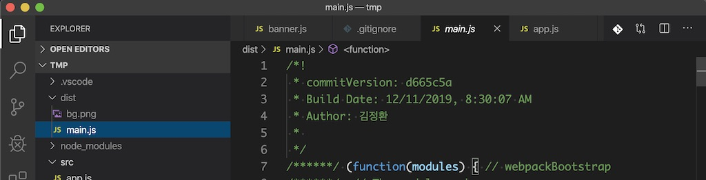

## webpack이란?

bundler 묶는다. 즉 여러개의 파일을 묶어준다. (webpack, broserify, parcel)

```javascript
npm i --save --dev webpack webpack-cli
```

### 웹팩 설정

**entry :** 시작파일 지정 (default : './src/index.js')

**output :** bundling 후 만들어질 파일 위치

- filename : '[name].js' // 다중entry사용시 이름을 일일이 지정안해도 됨
- path : path.resovle('\dist') // path 라이브러리를 이용한 경로 설정

**mode :** 'developer' , 'production' , 'none' 3가지 모드 있음(환경변수 설정으로 분기처리가능)

**loader :** 설정해둔 특정 확장자 파일을 loader로 읽어 output으로 만들어감

```javascript
    // 로더는 각 파일에 대해서 적용하고 내용을 변환함
    module : {
    	rules : [{
    		test: /\.js$/, // .js로 끝나는 파일은 로더 실행
    		use : [path.resolve('./myloader.js')], //방금 만든 커스텀 로더
    	}],
    }
```

- 자주사용하는 로더

  - css -loader

  ```javascript
  module.exports = {
    module: {
      rules: [
        {
          test: /\.css$/, // .css로 끝나는 파일은 로더 실행
          use: ['css-loader'],
        },
      ],
    },
  };
  ```

  - style-loader

  ```javascript
  module.exports = {
    module: {
      rules: [
        {
          test: /\.css$/, // .css로 끝나는 파일은 로더 실행
          use: ['style-loader', 'css-loader'], //순서 중요 뒤에서부터 앞방양으로 처리함.
        },
      ],
    },
  };
  ```

  - file-loader

  ```javascript
  module.exports = {
    module: {
      rules: [
        {
          test: /\.png$/, // .png로 끝나는 파일은 로더 실행
          loader: 'file-loader', //파일 로더 적용
          options: {
            publicPath: '/dist/', // prefix를 아웃풋 경로로 지정
            name: '[name].[ext]?[hash]', //파일명 형식
          },
        },
      ],
    },
  };
  ```

  - url-loader (기본적으로 file-loader를 내장하고 있음)

  ```javascript
  {
    test: /\.png$/, // .png로 끝나는 파일은 로더 실행
        loader : 'url-loader', //url 로더 적용
        options : {
          publicPath : '/dist/',  // prefix를 아웃풋 경로로 지정
          name : '[name].[ext]?[hash]', //파일명 형식
          limit : 5000,  //5kb 미만 파일만 data url로 처리
        }
  }
  //작은 이미지 로더할때 상황에 맞게 사용
  ```

**plugin :** 웹팩이 각 모듈들을 처리하는데 만들어지기 직전에 후처리하는데 그런부분을 플러그인이라고함.

```javascript
class MyPlugin {
  apply(compiler) {
    compiler.hooks.done.tap('My Plugin', stats => {
      console.log('MyPlugin: done');
    });
  }
}

module.exports = MyPlugin;

const MyPlugin = require('./myplugin');

module.exports = {
  plugins: [new MyPlugin()],
};
```

모듈은 설정한 파일 하나 혹은 여러 개에 대해 동작하지만, 플러그인은 그것을 하나로 번들링한 결과물을 대상으로 한다. 우리 예제에서는 main.js로 결과물이 하나이기 때문에 플러그인이 한번만 동작한 것이다.

```javascript
// 웹팩 내장 플러그인 BannerPlugin 코드를 참고
class MyPlugin {
  apply(compiler) {
    compiler.hooks.done.tap('My Plugin', stats => {
      console.log('MyPlugin: done');
    });

    compiler.plugin('emit', (compilation, callback) => {
      // compiler.plugin() 함수로 후처리한다
      const source = compilation.assets['main.js'].source();
      console.log(source);
      callback();
    });
  }
}

module.exports = MyPlugin;
```

```javascript
class MyPlugin {
  apply(compiler) {
    compiler.plugin('emit', (compilation, callback) => {
      const source = compilation.assets['main.js'].source();
      compilation.assets['main.js'].source = () => {
        const banner = [
          '/**',
          ' * 이것은 BannerPlugin이 처리한 결과입니다.',
          ' * Build Date: 2019-10-10',
          ' */',
        ].join('\n');
        return banner + '\n\n' + source;
      };

      callback();
    });
  }
}
```

**플러그인 종류**

- BannerPlugin

  ```javascript
  const banner = require('./banner.js');

  new webpack.BannerPlugin(banner);

  // banner.js
  const childProcess = require('child_process');

  module.exports = function banner() {
    const commit = childProcess.execSync('git rev-parse --short HEAD');
    const user = childProcess.execSync('git config user.name');
    const date = new Date().toLocaleString();

    return (
      `commitVersion: ${commit}` + `Build Date: ${date}\n` + `Author: ${user}`
    );
  };
  ```

  

- DefinePlugin : 빌드 타임에 결정된 값을 어플리이션에 전달할 때는 이 플러그인을 사용
- HtmlWebpackPlugin : HTML 파일을 후처리하는데 사용
- CleanWebpackPlugin : 빌드 이전 결과물을 제거하는 플러그인
- MiniCssEXtractPlugin : 번들 결과에서 스트일시트 코드만 뽑아서 별도의 CSS 파일로 만들어 역할에 따라 파일을 분리하는 것이 좋다. 브라우져에서 큰 파일 하나를 내려받는 것 보다, 여러 개의 작은 파일을 동시에 다운로드하는 것이 더 빠르다.개발 환경에서는 CSS를 하나의 모듈로 처리해도 상관없지만 프로덕션 환경에서는 분리하는 것이 효과적이다.

**devServer :** 웹서버

**Code splitting :** 쪼개는 과정

**Lazy Loading :** 필요할때마다 로딩

### 정리

ECMAScript2015 이전에는 모듈을 만들기 위해 즉시실행함수와 네임스페이스 패턴을 사용했다. 이후 각 커뮤니티에서 모듈 시스템 스펙이 나왔고 웹팩은 ECMAScript2015 모듈시스템을 쉽게 사용하도록 돕는 역할을 한다.

[참조 블로그](http://jeonghwan-kim.github.io/series/2019/12/10/frontend-dev-env-webpack-basic.html)
[참조 영상](https://www.youtube.com/watch?v=bBYrpK5gjk0)
