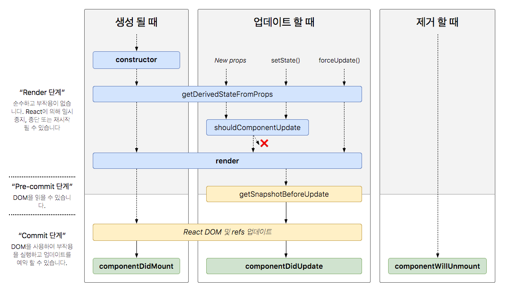

라이플사이클은 총 세가지, 즉 **마운트**, **업데이트**, **언마운트** 카테고리로 나눕니다.

리액트 컴포넌트 라이프 사이클 (React Component Life Cycle)

  

생성 될 때 (Mount) 호출되는 함수

**constructor** : 컴포넌트를 새로 만들 때마다 호출되는 클래스 생성자 메서드

**getDerivedStateFromProps** : props에 있는 값을 state에 동기화하는 메서드

**render** : UI를 렌더링하는 메서드

**componentDidMount** : 컴포넌트가 웹 브라우저상에 나타난 후 호출하는 메서드

업데이트 할때 (Update) 호출되는 함수

컴포넌트가 업데이트되는 경우는 4자이다.

- props가 바뀔 때
- state가 바뀔 때
- 부모 컴포넌트가 리렌더링될 때
- this.forceUpdate가 강제로 렌더링을 트리거 할때

**getDerivedStateFromProps :** , 마운트 과정에서 호출되며 props가 바뀌어서 업데이트할 때도 호출된다.

**shouldComponentUpdate** : 컴포넌트가 리렌더링을 해야 할지 말아야 할지를 결정하는 메서드이다. 여기에 false를 반환하면 아래 메서드들을 호출하지 않는다.

**render** : 컴포넌트를 리렌더링하는 메서드

**getSnapshotBeforeUpdate** : 컴포넌트 변화를 DOM에 반영하기 바로 직전에 호출하는 메서드

**componentDidUpdate** : 컴포넌트의 업데이트 작업이 끝난 후 호출하는 메서드

제거될 때 (UNMOUNT) 호출되는 함수

**componentWillUnmount** : 컴포넌트가 웹 브라우저상에서 사라지기 전에 호출하는 메서드

**render()**

이 메서드 안에서 this.props와 this.state에 접근할 수 있다. 아무것도 보여주고 싶지않다면 null 값이나 false 값을 반환하도록 한다.

이 메서드 안에서는 state 값을 변형해서는 안되며, 웹 브라우저에 접근해서 도 안된다.

DOM 정보를 가져오거나 변화를 줄 때는 **componentDidMount** 에서 처리해야 한다.

**construcotr**

컴포넌트 생성자 메서드로 컴포넌트를 만들 때 처음 실행된다. state 초기화 할 수 있다.

**getDerivedStateFromProps**

리액트 v16.3 이후에 새로 만든 라이프사이클 메서드 이다. props로 받아 온 값을 state에 동기화시키는 용도로 사용하며, 컴포넌트를 마운트하거나 props 변경할 때 호출한다.
```javascript
static getDerivedStateFromProps(nextProps, prevState) {


  if (nextProps.value !== prevState.value) { // 조건에 따라 특정 값 동기화
    return {
      value: nextProps. value,

    };
  }

  // state를 변경할 필요가 없다면 null을 반환
  return null;
}
```
**componentDidMount**

컴포넌트를 만들고 첫 렌더링을 마친뒤 실행된다. 이 안에서는 다른 자바스크립트 라이브러리 또는 프레임워크 함수를 호출하거나 이벤트 등록, setTimeout, setInterval, 네트워크 요청 같은 비동기 작업을 처리하면 된다.

**shouldComponentUpdate**

props 또는 state를 변경했을 때, 리렌더링을 시작할지 여부를 지정하는 메서드이다. 반드시 true 또는 false 값을 반환해야한다.

이 메서드가 false를 반환하면 업데이트 과정은 중지된다.

이 메서드 안에서 현재 props와 state는 this.props와 this.state로 접근하고, 새로 설정될 props 또는 state는 nextProps와 nextState로 접근할 수 있다.

**getSnapshotBeforeUpdate**

리액트 v16.3 이후에 만든 메서드이다. 이 메서드는 render 메서드를 호출한 후 DOM에 변화를 반영하기로 바로 직전에 호출하는 메서드 이다. 여기에서는 반환하는 값은 **componentDidUpdate** 에서 세번째 파라미터인 snapshot 값으로 전달 받을 수 있다.

주로 업데이트 하기 직전의 값을 참고할 때 사용된다. (예 : 스크롤바 위치 유지)
```javascript
getSnapshotBeforeUpdate(prevProps, prevState) {
    if(prevState.array !== this.state.array) {
        const {scrollTop, scrollHeight} = this.list
        return {scrollTop, scrollHeight}
    }
}
```
**componentDidUpdate**

리렌더링을 완료한 후 실행된다. 업데이트 가 끝난 직후 이므로, DOM관련 처리를 해도 무방하다. 여기에서는 prevProps 또는 prevState를 사용하여 컴포넌트가 이전에 가졌던 데이터에 접근할 수 있다. 또 getSnapshotBeforeUpdate에서 반환 값이 있다면 여기에서 snapshot 값을 전달받을 수 있다.
```javascript
componentDidUpdate(prevProps, prevState, snapshot) {. . . }
```
**componentWillUnmount**

컴포넌트를 DOM에서 제거할 때 실행한다. **componentDidMount** 에서 등록한 이벤트, 타이머, 직접 생성한 DOM이 있다면 여기에서 제거 작업을 해야 한다.